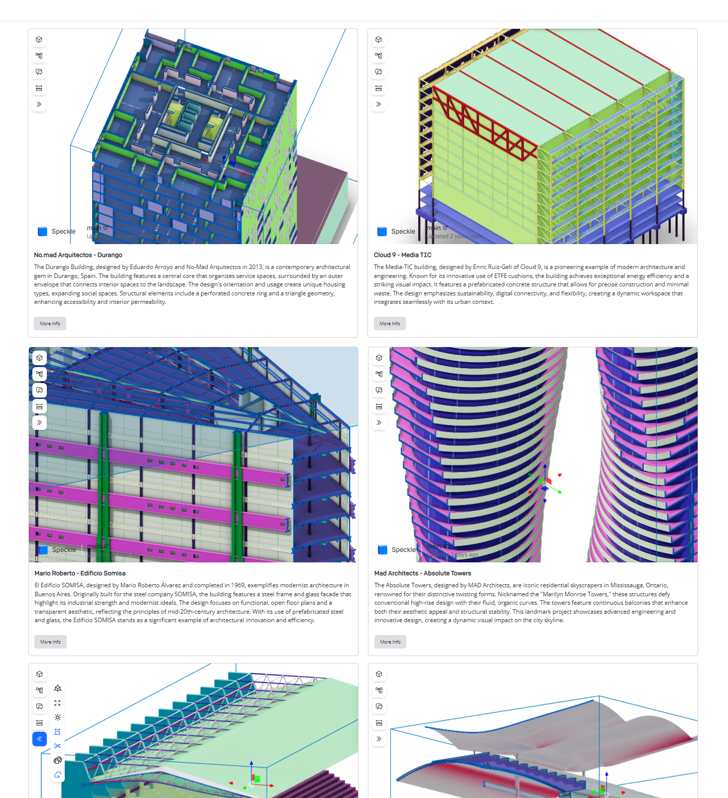
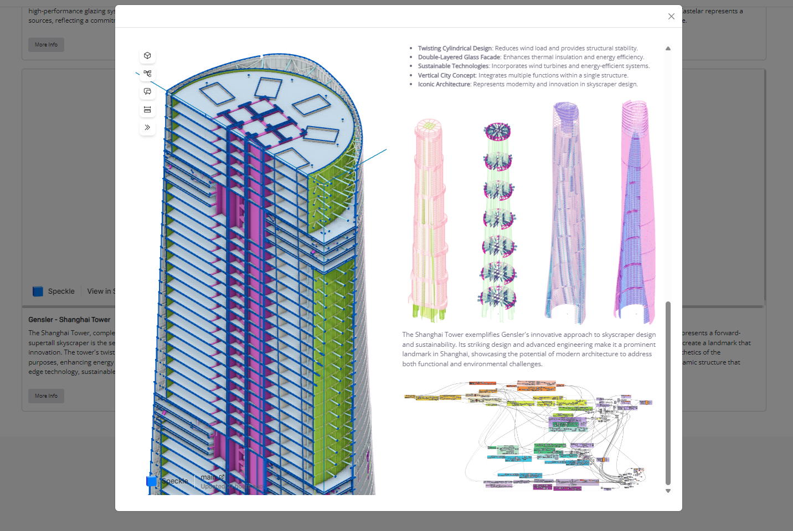

# Speckle Mockup


*Main Page of the Speckle Mockup. Grid displaying available models*


*Detail of the models*


## Description

The Speckle Mockup is a Dash application that showcases the capabilities of the Speckle platform. The application is
designed to display embedded iframes from Speckle, customized Dash components, CSS styles, and Dash callbacks. The
application is built using Python and the Dash framework, and it is intended to be used as a demonstration of the
Speckle API.

### Features

- Embedded Iframes from Speckle
- Customized Dash components
- Customized CSS styles
- Customized Dash callbacks

## Project Structure

```
speckle-showcase/
├── config/
│   └── urls_speckle.py
│   └── settings.py
├── pages/
│   └── home.py
├── src/
│   └── callback_modal.py
├── static/
│   └── fonts/
│   └── images/
│   └── icons/
│   └── styles.css
├── utils/
├── README.md
├── requirements.txt
├── app_initialization.py
└── main.py
```

### Key Files and Their Roles

1. **`config/urls_speckle.py`**:
    - Contains parameters used in the application, such as `durango`, `mediatic`, `euskotren`, etc.

2. **`pages/home.py`**:
    - Defines the layout and components of the home page of the Dash application.
    - Imports necessary libraries and components.
    - Registers the home page with the Dash application.
    - Contains the layout for the welcome modal, header, footer, and main grid components.

3. **`README.md`**:
    - Currently empty but should contain a description of the project, setup instructions, and other relevant
      information.

4. **`requirements.txt`**:
    - Lists the dependencies required for the project.

5. **`app.py`**:
    - Likely the main entry point for the Dash application, initializing the app and setting up the server.

## Running the Application

1. Install the required packages: `pip install -r requirements.txt`
1. Start the Dash application:`python app.py`
2. Open your web browser and navigate to `http://127.0.0.1:8060/` to view the application.

## License

This project is licensed under the MIT License.

